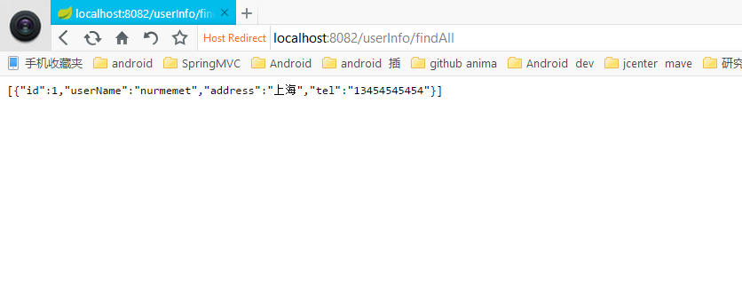
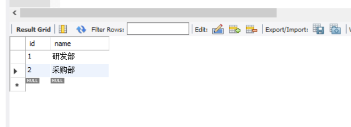
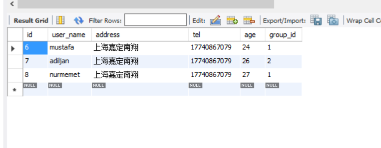
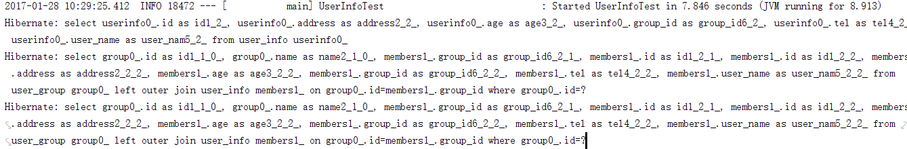
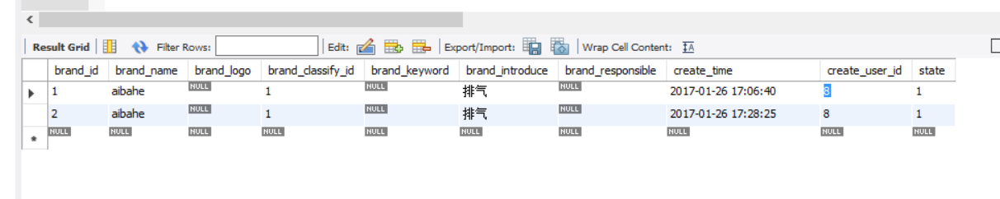
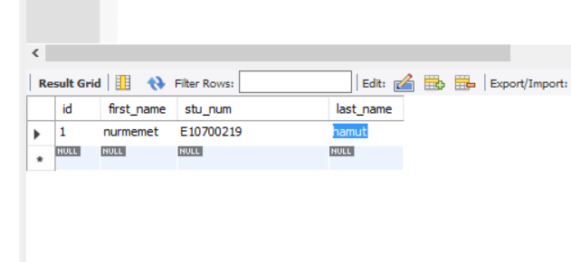
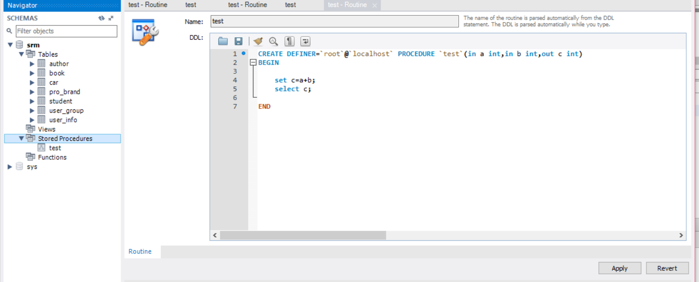
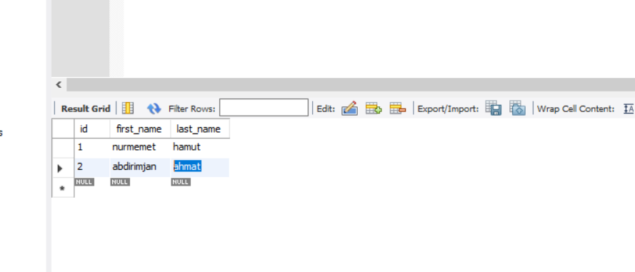

# Spring Data Jpa

### 什么是Spring Data?  
[Spring Data](http://projects.spring.io/spring-data/)’s mission is to provide a familiar and consistent, Spring-based programming model for data access while
still retaining the special traits of the underlying data store. It makes it
easy to use data access technologies, relational and non-relational
databases, map-reduce frameworks, and cloud-based data services. This
is an umbrella project which contains many subprojects that are specif
ic to a given database. The projects are developed by working toget
her with many of the companies and developers that are behind these exciting
technologies.  
Spring Data 的目标是为数据存储提供方便，一致的，基于Spring编码方式的编程模型
它将操作关系型数据库和非关系型数据，云存储，map-reduce变得相当方便
这是一个大型项目，包含很多子项目，根据数据库的不同而不同，这些项目会从事相关领域的
一些大型公司或该领域的一些顶级专家维护并开发.  
目前已发布的项目有  
* Spring Data Commons  
* Spring Data JPA
* Spring Data KeyValue
* Spring Data LDAP
* Spring Data MongoDB
* Spring Data Gemfire
* Spring Data REST
* Spring Data Redis
* Spring Data for Apache Cassandra
* Spring Data for Apache Solr
* Spring Data Couchbase (community module)
* Spring Data Elasticsearch (community module)
* Spring Data Neo4j (community module)  

#### 什么是Spring Data Jpa?
[Spring Data JPA](http://projects.spring.io/spring-data-jpa/), part of the larger 
Spring Data family, makes it easy 
to easily implement JPA based repositories. This module 
deals with enhanced support for JPA based data access layers.
 It makes it easier to build Spring-powered applications that use 
 data access technologies.  
 Spring Data Jpa是 Spring Data 大家庭的一员，它把基于Jpa的库的实现变得相当
 容易，Spring Data Jpa 是为了简化Spring支持的项目的数据存储过程  
 
####SpringBoot中Spring Data Jpa的使用
SpringBoot中Spring Data Jpa([官方文档](http://docs.spring.io/spring-data/jpa/docs/current/reference/html/))的使用非常简单，在你的gradle文件中只添加以下内容即可
 ```groovy
 compile('org.springframework.boot:spring-boot-starter-data-jpa')
```
包含Spring Data Jpa必须在 application.properties文件中配置数据源否则启动报错
```properties
#本例子中使用alibaba Druid作为数据库连接池,如果使用Tomcat jdbc作为数据库连接池可以不配置这个选项
spring.datasource.type=com.alibaba.druid.pool.DruidDataSource
spring.datasource.driver-class-name=com.mysql.jdbc.Driver
spring.datasource.url=jdbc:mysql://localhost:3306/srm
spring.datasource.username=root
spring.datasource.password=123456
```
使用alibaba Druid数据库连接池，gradle中还得引入Druid(该库的版本你可以先搜maven找到最新版本)
```groovy
compile group: 'com.alibaba', name: 'druid', version: '1.0.27'
```
之后在启动类添加注解
```java
import org.springframework.boot.web.support.SpringBootServletInitializer;
import org.springframework.data.jpa.repository.config.EnableJpaRepositories;

/**
 * Created by Administrator on 1/23/2017.
 */
@SpringBootApplication(scanBasePackages = "com.cn")
@EnableJpaRepositories("com.cn.reposity")
@EntityScan("com.cn.entity")
public class SampleApplication extends SpringBootServletInitializer {
    @Override
    protected SpringApplicationBuilder configure(SpringApplicationBuilder builder) {
        return builder.sources(SampleApplication.class);
    }
    public static void main(String[] args){
        SpringApplication.run(SampleApplication.class,args);
    }
}

```
Dao层
```java
package com.cn.reposity;

import com.cn.entity.UserInfo;
import org.springframework.data.repository.CrudRepository;

import javax.transaction.Transactional;
import java.util.List;
/**
 * Created by Administrator on 1/23/2017.
 */
public interface UserInfoDao extends CrudRepository<UserInfo,Long> {
    UserInfo findByUserName(String name);
    List<UserInfo> findAll();
}

```
Service层
```java
package com.cn.service;

import com.cn.entity.UserInfo;
import com.cn.reposity.UserInfoDao;
import org.springframework.beans.factory.annotation.Autowired;
import org.springframework.stereotype.Service;
import org.springframework.transaction.annotation.Transactional;

import java.util.LinkedList;
import java.util.List;

/**
 * Created by Administrator on 1/23/2017.
 */
@Service
@Transactional
public class UserInfoService {

    @Autowired
    UserInfoDao userInfoDao;

    public UserInfo addUserInfo(UserInfo userInfo) {
        return userInfoDao.save(userInfo);
    }

    public List<UserInfo> findAll() {
        return userInfoDao.findAll();
    }
}

```
Controller层
```java
package com.cn.controller;

import com.cn.entity.UserInfo;
import com.cn.service.UserInfoService;
import org.springframework.beans.factory.annotation.Autowired;
import org.springframework.stereotype.Controller;
import org.springframework.web.bind.annotation.RequestMapping;
import org.springframework.web.bind.annotation.ResponseBody;

import java.util.List;

/**
 * Created by Administrator on 1/23/2017.
 */
@Controller
@RequestMapping("userInfo")
public class UserInfoController {
    @Autowired
    UserInfoService userInfoService;

    @ResponseBody
    @RequestMapping("add")
    public String  add(UserInfo userInfo){
        userInfo=new UserInfo();
        userInfo.setUserName("alim");
        userInfo.setAddress("和田");
        userInfo.setTel("121212121");
        userInfoService.addUserInfo(userInfo);
        return "success";
    }

    @ResponseBody
    @RequestMapping("findAll")
    public List<UserInfo> findAll(UserInfo userInfo){
        return userInfoService.findAll();
    }

}

```
效果  


####Spring data jpa 查询([官方文档](http://docs.spring.io/spring-data/jpa/docs/current/reference/html/#jpa.query-methods))  

* 根据方法名查询
* 使用@Query查询
* 使用@Quey注解的时候实体类必须用@Table(name="表明")注解来配置映射,发现不用@Query的时候用@Entity(name="表名")注解来配置映射不报错
，但是用@Query就必须用@Table注解来配置映射
* @Query+ @Modifying+ @Transactional 如果是更新语句必须得加上@Modifying注解和@Transactional注解,注意返回值，
是int类型，是本次操作影响的行数
```java
package com.cn.reposity;

import com.cn.entity.UserInfo;
import org.springframework.data.domain.Sort;
import org.springframework.data.jpa.repository.Modifying;
import org.springframework.data.jpa.repository.Query;
import org.springframework.data.repository.CrudRepository;
import org.springframework.data.repository.query.Param;
import org.springframework.stereotype.Repository;

import javax.transaction.Transactional;
import java.util.List;
/**
 * Created by Administrator on 1/23/2017.
 * 官方文档 https://docs.spring.io/spring-data/jpa/docs/current/reference/html/
 */
public interface UserInfoDao extends CrudRepository<UserInfo,Long> {
    /**
     * 根据属性名称查询
     * @param name
     * @return
     */
    List<UserInfo> findByUserName(String name);

    /**
     * 通过属性名称查询
     * @param userName
     * @param address
     * @return
     */
    List<UserInfo> findByUserNameAndAddress(String userName,String address);
    /**'
     * 多个属性名称查询
     * @param userName
     * @param address
     * @param tel
     * @return
     */
    List<UserInfo> findByUserNameAndAddressAndTel(String userName,String address,String tel);


    /**
     * 查询全部
     * @return
     */
    List<UserInfo> findAll();

    /**
     * Or 查询
     * @param userName
     * @param tel
     * @return
     */
    List<UserInfo> findByUserNameOrTel(String userName ,String tel);

    /**
     * Between 查询
     * @param start
     * @param en
     * @return
     */
    List<UserInfo> findByAgeBetween(int start,int en);

    /**
     * lessthan 查询
     * @param age
     * @return
     */
    List<UserInfo> findByAgeLessThan(int age);

    /**
     * greaterThan 查询
     * @param age
     * @return
     */
    List<UserInfo> findByAgeGreaterThan(int age);

    /**
     * isNull查询
     * @return
     */
    List<UserInfo> findByAgeIsNull();

    /**
     * NotNull查询
     * @return
     */
    List<UserInfo> findByAgeNotNull();

    /**
     * like查询
     * @param userName
     * @return
     */
    List<UserInfo> findByUserNameLike(String userName);

    /**
     * NotLike查询
     * @param userName
     * @return
     */
    List<UserInfo> findByUserNameNotLike(String userName);

    /**
     * OrderBy Desc
     * @param userName
     * @return
     */
    List<UserInfo> findByAddressOrderByIdDesc(String userName);

    /**
     * OrderBy Asc
     * @param userName
     * @return
     */
    List<UserInfo> findByAddressOrderByIdAsc(String userName);


    /**
     * Not查询
     * @param age
     * @return
     */
    List<UserInfo> findByAgeNot(int age);

    /**
     * In 查询
     * @param ageList
     * @return
     */
    List<UserInfo> findByAgeIn(List<Integer> ageList);

    /**
     * NotIn 查询
     * @param ageList
     * @return
     */
    List<UserInfo> findByAgeNotIn(List<Integer> ageList);

    /**
     * 使用@Quey注解的时候实体类必须用@Table(name="表明")注解来配置映射,发现不用@Query的时候用@Entity(name="表名")注解来配置映射不报错，但是用@Query就必须用@Table注解来配置映射
     * @param userName
     * @return
     */
    @Query("select u from UserInfo u where  u.userName=?1")
    List<UserInfo> queryByUserName(String userName);

    /**
     * Sort 排序,Sort的构造  new Sort("实体类字段名"),这种排序只能跟@Query一起使用
     * @param address
     * @param sort
     * @return
     */
    @Query("select u from UserInfo u where  u.address=?1")
    List<UserInfo> findByAddressAndSort(String address,Sort sort);

    /**
     * @Query +@param查询
     * @param userName
     * @param address
     * @return
     */
    @Query("select u from UserInfo u where  u.userName=:name and u.address=:add")
    List<UserInfo> findByNameAndAddress(@Param("name")String userName, @Param("add")String address);

    /**
     * @Query+ native sql 查询
     * @param userName
     * @return
     */
    @Query(value = "select u.* from user_info u where u.user_name=?1",nativeQuery = true)
    List<UserInfo> queryNative(String userName);

    /**
     * @Query+ @Modifying+ @Transactional 如果是更新语句必须得加上@Modifying注解和@Transactional注解,注意返回值，是int类型，是本次操作影响的行数
     * @return
     */
    @Modifying
    @Transactional
    @Query("update UserInfo u set u.userName=?2 where  u.userName=?1")
    int udpateByUserName(String userNameOld,String userNameNew);


}

```
#### @ManyToOne,@OneToMany注解的使用
* fetch属性的含义  
查询模式分别是Lazy（懒加载，当调用该属性的getter方法时才查询数据）,EAGER（第一次查询时跟其它的属性一并带出来）
* cascade 属性的含义  
级联操作模式，比如当更新或删除UerInfo时,UserInfo对象里面的Group对象会不会更新或删除
* optional 属性的含义  
级联关系是否一定存在 ，optional会决定left join(查询所有符合条件的UserInfo并赋上group) 还是innerjoin(只返回两个表中链接字段相等的行)
```java
package com.cn.entity;

import javax.persistence.*;
import java.io.Serializable;

/**
 * Created by Administrator on 1/23/2017.
 */
@Entity
@Table(name = "user_info")
public class UserInfo implements Serializable{

    @Id
    @GeneratedValue
    private Long id;
    private String userName;
    private String address;
    private String tel;
    private String age;
    //抓取方式默认是Lazy，Lazy是懒加载 意思第一次查询的时候不查group 这个属性 当用到这个实体类的group字段的get方法是才去数据库读取
    //这个字段,是Spring Jpa的一个特性，是因为有的时候我们原本就不想查出这个group信息而只是想查出UserInfo的基本信息，所以算是一个性能的保障。
    //而FetchType.EAGER顾名词义就是立刻查询的意思，就跟第一次查询的时候跟UserInfo的其他属性一起查出来
    //但是就算是一次性查出来（FetchType.EAGER），Spring 也不用一条sql来查出来而用多个sql查询，拼出结果
    //UserInfo->Group  是多对一的关系
    //JoinColumn 是user_info表里的字段
    @ManyToOne(fetch =FetchType.LAZY)
    @JoinColumn(name = "group_id")//user_info表中关联user_group表的字段名称,如果此处不加@JoinColumn jpa会在user_info表里面寻找group_id(下面的group字段后面_id)如果找不到报错
    private Group group;

    public Group getGroup() {
        return group;
    }

    public void setGroup(Group group) {
        this.group = group;
    }


    public String getAge() {
        return age;
    }
    public void setAge(String age) {
        this.age = age;
    }
    public Long getId() {
        return id;
    }

    public void setId(Long id) {
        this.id = id;
    }

    public String getUserName() {
        return userName;
    }

    public void setUserName(String userName) {
        this.userName = userName;
    }

    public String getAddress() {
        return address;
    }

    public void setAddress(String address) {
        this.address = address;
    }

    public String getTel() {
        return tel;
    }

    public void setTel(String tel) {
        this.tel = tel;
    }


}


```

```java
package com.cn.entity;

import com.fasterxml.jackson.annotation.JsonBackReference;

import javax.persistence.*;
import java.util.ArrayList;
import java.util.List;

/**
 * Created by Administrator on 1/27/2017.
 */
@Entity
@Table(name = "user_group")
public class Group {

    @Id
    @GeneratedValue
    private Long id;
    private String name;

    //fetch 默认值是 FetchType.Lazy
    //Group->UserInfo 是一对多的关系 ，注意mappedBy是UserInfo实体类里面的字段名而不是user_info数据库表里面的字段名
    @OneToMany(mappedBy = "group",fetch =FetchType.EAGER)
    private List<UserInfo> members=new ArrayList<>();


    public Long getId() {
        return id;
    }

    public void setId(Long id) {
        this.id = id;
    }

    public String getName() {
        return name;
    }

    public void setName(String name) {
        this.name = name;
    }

    public List<UserInfo> getMembers() {
        return members;
    }

    public void setMembers(List<UserInfo> members) {
        this.members = members;
    }


}

```
下面是测试方法,如果上面的@OneToMany，@ManyToOne注解的fetch（UserInfo类里有说明）属性设置为Lazy本例子中
会报错是因为,因为在测试类中当第一次查完数据库之后session 就会关闭，当 JSON.toJSONString
里面用group的getGroup方法的时候因为session关闭状态无法查询数据库而报错，Controller中就不会这样
是因为正是项目当中jpa session 的生命周期跟request的生命周期一样，当request返回之后session才被关闭
还有一点springboot默认是使用google Gson作为HttpMessageConverter，而Gson默认是不支持循环引用检测
下面的测试中Group里面有members成员这个会指向UserInfo,存在循环以来，这样导致Gson转换这个UserInfo
对象的时候导致死循环内存溢出（配置fastjson为HttpMessageConverter在上一个项目中有讲解）

```java
import com.alibaba.fastjson.JSON;
import com.cn.app.SampleApplication;
import com.cn.entity.Brand;
import com.cn.entity.UserInfo;
import com.cn.reposity.BrandDao;
import com.cn.reposity.UserInfoDao;
import org.junit.Test;
import org.junit.runner.RunWith;
import org.springframework.beans.factory.annotation.Autowired;
import org.springframework.boot.test.context.SpringBootTest;
import org.springframework.data.domain.Sort;
import org.springframework.test.context.junit4.SpringJUnit4ClassRunner;

import java.util.List;

/**
 * Created by Administrator on 1/25/2017.
 */


@RunWith(SpringJUnit4ClassRunner.class)
@SpringBootTest(classes = SampleApplication.class)
public class UserInfoTest {
...
    @Test
    public void ManyToOneTest() {
        List<UserInfo> list = userInfoDao.findAll();
        //用fastjson转换JSON输出
        //注意，不要用JSON.toJSON()方法输出，此方默认不支持循环引用检测，导致序列化的时候内存溢出
        System.out.println( JSON.toJSONString(list));
    }
...

}

```
下面相关表结构

  
下面是上面测试输出的sql语句，哪怕注释掉Group表里面的members字段，它也不会用
left join的方式一次性查出UserInfo的信息而分两次查询第一次查出UserInfo Group之外的字段
然后根据group_id查出Group再拼接，有几个gruop_id查询几次，上面的例子中UserInfo表里面有三条数据
但group表只查询两次是因为 UserInfo表里面的group_id有重复，分别是1,1,2


####使用@CreatedBy,@CreatedDate注解
* 启动类添加@EnableJpaAuditing注解
```java
package com.cn.app;

import org.springframework.boot.SpringApplication;
import org.springframework.boot.autoconfigure.SpringBootApplication;
import org.springframework.boot.autoconfigure.domain.EntityScan;
import org.springframework.boot.builder.SpringApplicationBuilder;
import org.springframework.boot.web.support.SpringBootServletInitializer;
import org.springframework.data.jpa.repository.config.EnableJpaAuditing;
import org.springframework.data.jpa.repository.config.EnableJpaRepositories;

/**
 * Created by Administrator on 1/23/2017.
 */
@SpringBootApplication(scanBasePackages = "com.cn")
@EnableJpaRepositories("com.cn.reposity")
@EntityScan("com.cn.entity")
@EnableJpaAuditing
public class SampleApplication extends SpringBootServletInitializer {
    @Override
    protected SpringApplicationBuilder configure(SpringApplicationBuilder builder) {
        return builder.sources(SampleApplication.class);
    }
    public static void main(String[] args){
        SpringApplication.run(SampleApplication.class,args);
    }
}

```
* 先实现implements AuditorAware<T>  
让任意一个被Spring系统扫描到的类实现以上接口，是用户实体类，本例子中UserInfo,本例子中UserInfoService实现该接口
以下只是模拟数据，实际应用当中只要你返回一个当前用户对象就可以
```java
package com.cn.service;

import com.cn.entity.UserInfo;
import com.cn.reposity.UserInfoDao;
import org.springframework.beans.factory.annotation.Autowired;
import org.springframework.data.domain.AuditorAware;
import org.springframework.stereotype.Service;
import org.springframework.transaction.annotation.Transactional;

import java.util.List;

/**
 * Created by Administrator on 1/23/2017.
 */
@Service
@Transactional
public class UserInfoService implements AuditorAware<UserInfo>{

    @Autowired
    UserInfoDao userInfoDao;

    /**
     * 添加
     * 如果userInfo存在Id那么更新，不存在添加
     * @param userInfo
     * @return
     */
    public UserInfo addUserInfo(UserInfo userInfo) {
        return userInfoDao.save(userInfo);
    }

    /**
     * 查询全部
     * @return
     */
    public List<UserInfo> findAll() {
        return userInfoDao.findAll();
    }

    public  List<UserInfo> findByUserName(String userName){
        return userInfoDao.findByUserName(userName);
    }


    @Override
    public UserInfo getCurrentAuditor() {
        UserInfo userInfo=new UserInfo();
        userInfo.setUserName("nurmemet");
        userInfo.setId(8L);
        return userInfo;
    }
}

```
* 添加@EntityListeners(AuditingEntityListener.class)注解
还有注意字段名称实体类里面是createUser 但在表里面这个字段是create_user_id

```java
package com.cn.entity;

import org.springframework.data.annotation.CreatedBy;
import org.springframework.data.annotation.CreatedDate;
import org.springframework.data.jpa.domain.support.AuditingEntityListener;

import javax.persistence.*;
import java.util.Date;

/**
 * Created by Administrator on 1/26/2017.
 */
@Entity
@Table(name = "pro_brand")
@EntityListeners(AuditingEntityListener.class)
public class Brand {


    @Id
    @GeneratedValue
    private Long brandId;
    private String brandName;
    private String brandLogo;
    private Long brandClassifyId;

    public String getBrandKeyword() {
        return brandKeyword;
    }

    public void setBrandKeyword(String brandKeyword) {
        this.brandKeyword = brandKeyword;
    }

    private String brandKeyword;
    private String brandIntroduce;
    private String brandResponsible;

    @CreatedDate
    private Date createTime;

    public UserInfo getCreateUser() {
        return createUser;
    }

    public void setCreateUser(UserInfo createUser) {
        this.createUser = createUser;
    }

    //@JoinColumn注解指明该字段跟数据库的哪个字段关联如果不加，此处Jpa会在brand表里面寻找create_user_id字段（根据下面的字段生成,加_id）
    @CreatedBy
    @OneToOne
    private UserInfo createUser;
    private Integer state;

    public Long getBrandId() {
        return brandId;
    }

    public void setBrandId(Long brandId) {
        this.brandId = brandId;
    }

    public String getBrandName() {
        return brandName;
    }

    public void setBrandName(String brandName) {
        this.brandName = brandName;
    }

    public String getBrandLogo() {
        return brandLogo;
    }

    public void setBrandLogo(String brandLogo) {
        this.brandLogo = brandLogo;
    }

    public Long getBrandClassifyId() {
        return brandClassifyId;
    }

    public void setBrandClassifyId(Long brandClassifyId) {
        this.brandClassifyId = brandClassifyId;
    }


    public String getBrandIntroduce() {
        return brandIntroduce;
    }

    public void setBrandIntroduce(String brandIntroduce) {
        this.brandIntroduce = brandIntroduce;
    }

    public String getBrandResponsible() {
        return brandResponsible;
    }

    public void setBrandResponsible(String brandResponsible) {
        this.brandResponsible = brandResponsible;
    }

    public Date getCreateTime() {
        return createTime;
    }

    public void setCreateTime(Date createTime) {
        this.createTime = createTime;
    }


    public Integer getState() {
        return state;
    }

    public void setState(Integer state) {
        this.state = state;
    }


}

```
对应的数据库表  


#### @EntityGraph 动态改变 加载模式
下面本来Author里面的bookList是LAZY模式，我们通过在Dao层方法上加上@EntityGraph注解
把LAZY改成EAGER模式，@EntityGraph的attributePaths属性只可以是当前实体类里的属性
也可以是当前实体类里面某个属性的实体类的变量比如下面例子中的author.bookList,但是不能同时含有当前实体类的
属性和级联实体类的变量比如，要同时修改author和author里面的bookList的加载模式写成
{ "author","author.bookList" }这样是不对的

```java
package com.cn.entity;

import javax.persistence.*;

/**
 * Created by Administrator on 1/28/2017.
 */
@Entity
@Table(name = "book")
public class Book {

    @Id
    @GeneratedValue
    private Long id;
    private String name;
    @ManyToOne(fetch = FetchType.EAGER)
    @JoinColumn(name = "author_id")
    private Author author;


    public Long getId() {
        return id;
    }

    public void setId(Long id) {
        this.id = id;
    }

    public String getName() {
        return name;
    }

    public void setName(String name) {
        this.name = name;
    }

    public Author getAuthor() {
        return author;
    }

    public void setAuthor(Author author) {
        this.author = author;
    }

}

```
```java
package com.cn.entity;

import javax.persistence.*;
import java.util.ArrayList;
import java.util.List;

/**
 * Created by Administrator on 1/28/2017.
 */
@Entity
@Table(name = "author")
public class Author {

    @Id
    @GeneratedValue
    private Long id;
   private String name ;
    @OneToMany(mappedBy = "author",fetch = FetchType.LAZY)
    private List<Book> bookList=new ArrayList<>();

    public Long getId() {
        return id;
    }

    public void setId(Long id) {
        this.id = id;
    }

    public String getName() {
        return name;
    }

    public void setName(String name) {
        this.name = name;
    }

    public List<Book> getBookList() {
        return bookList;
    }

    public void setBookList(List<Book> bookList) {
        this.bookList = bookList;
    }


}

```
```java
package com.cn.reposity;

import com.cn.entity.Book;
import org.springframework.data.jpa.repository.EntityGraph;
import org.springframework.data.repository.CrudRepository;

/**
 * Created by Administrator on 1/28/2017.
 */
public interface BookDao extends CrudRepository<Book,Long> {

     /**
         * When the javax.persistence.loadgraph property is used to specify an entity graph, attributes that are specified
         * by attribute nodes of the entity graph are treated as FetchType.EAGER and attributes that are not specified are
         * treated according to their specified or default FetchType.
         *
         * @see JPA 2.1 Specification: 3.7.4.2 Load Graph Semantics
         * <p>
         *     在attributePaths里面声明的属性被视为FetchType.EAGER，其他属性被视为默认定义的加载模式
         * LOAD("javax.persistence.loadgraph"),
         * <p>
         * When the javax.persistence.fetchgraph property is used to specify an entity graph, attributes that are specified
         * by attribute nodes of the entity graph are treated as FetchType.EAGER and attributes that are not specified are
         * treated as FetchType.LAZY
         * @see JPA 2.1 Specification: 3.7.4.1 Fetch Graph Semantics
         *     在attributePaths里面声明的属性被视为FetchType.EAGER，其他属性被视为FetchType.LAZY
         * FETCH("javax.persistence.fetchgraph");
         */
    @EntityGraph(attributePaths = { "author.bookList" },type = EntityGraph.EntityGraphType.FETCH)
    Book findByName(String name);

}

```

#### 使用投影改变数据库返回的数据集合([官方文档](http://docs.spring.io/spring-data/jpa/docs/current/reference/html/#projections))
Spring提供投影的方式指定数据库返回的数据，这样有的时候可以避免查询一些不必要查询的数据，也可以提高查询性能
```java
package com.cn.entity;

import javax.persistence.Entity;
import javax.persistence.GeneratedValue;
import javax.persistence.Id;
import javax.persistence.Table;

/**
 * Created by Administrator on 1/30/2017.
 */
@Entity
@Table(name = "student")
public class Student {
    @Id
    @GeneratedValue
    private Long id;
    private String firstName;
    private String lastName;
    private String stuNum;


    public Long getId() {
        return id;
    }

    public void setId(Long id) {
        this.id = id;
    }

    public String getFirstName() {
        return firstName;
    }

    public void setFirstName(String firstName) {
        this.firstName = firstName;
    }

    public String getLastName() {
        return lastName;
    }

    public void setLastName(String lastName) {
        this.lastName = lastName;
    }

    public String getStuNum() {
        return stuNum;
    }

    public void setStuNum(String stuNum) {
        this.stuNum = stuNum;
    }

}

```

```java
package com.cn.projection;

import org.springframework.beans.factory.annotation.Value;

/**
 * Created by Administrator on 1/30/2017.
 */
public interface StudentPro {
    /**
     * 实体类成员变量的get方法
     * @return
     */
    String getFirstName();

    /**
     * 也可以不是实体类成员变量的get方法，但是这个时候你必须得告诉spring系统该字段是匹配实体类的那个字段
     * 也可以是实体类多个字段拼出来之后的结果，如下
     * @return
     */
    @Value("#{target.firstName} #{target.lastName}")
    String getFullName();

}

```

```java
package com.cn.reposity;

import com.cn.entity.Student;
import com.cn.projection.StudentPro;
import org.springframework.data.repository.CrudRepository;

/**
 * Created by Administrator on 1/30/2017.
 */
public interface StudentDao extends CrudRepository<Student,Long> {

    StudentPro findById(Long id);

}

```
测试类
```java
    /**
    *     @Test
          public void projectionTest(){
              StudentPro studentPro=studentDao.findById(1L);
              System.out.println(studentPro.getFullName());
              System.out.println(studentPro.getFirstName());
          }
    */
   
```
表结构  


####存储过程([官方文档](http://docs.spring.io/spring-data/jpa/docs/current/reference/html/#jpa.stored-procedures))
以下是一个Mysql存储过程的例子,StoredProcedures 按右键 创建存储过程  

粘贴以下代码  
```sql
CREATE DEFINER=`root`@`localhost` PROCEDURE `test`(in a int,in b int,out c int)
BEGIN

    set c=a+b;
    select c;
    
END
```
```java
package com.cn.entity;

import javax.persistence.*;

/**
 * Created by Administrator on 1/30/2017.
 * @NamedStoredProcedureQuery 的name 由EntityManager维护的指向数据库存储过程名称的一个引用
 * procedureName是数据库中存储过程的名称,out参数是作为方法的返回值返回Dao层声明方法的时候
 * 不会在函数的参数列表出现，例如以下存储过程对应的Dao层函数为
 *   @Procedure
 *   int procedure1(@Param("a") Integer a, @Param("b") Integer b);
 */
@Entity
@Table(name = "car")
@NamedStoredProcedureQuery(name = "Car.procedure1", procedureName = "test", parameters = {
        @StoredProcedureParameter(mode = ParameterMode.IN, name = "a", type = Integer.class),
        @StoredProcedureParameter(mode = ParameterMode.IN, name = "b", type = Integer.class),
        @StoredProcedureParameter(mode = ParameterMode.OUT, name = "c", type = Integer.class)
})
public class Car {
    @Id
    @GeneratedValue
    private Long id;
    private String name;


    public Long getId() {
        return id;
    }

    public void setId(Long id) {
        this.id = id;
    }

    public String getName() {
        return name;
    }

    public void setName(String name) {
        this.name = name;
    }
}

```
```java
package com.cn.reposity;

import com.cn.entity.Car;
import org.springframework.data.jpa.repository.query.Procedure;
import org.springframework.data.repository.CrudRepository;
import org.springframework.data.repository.query.Param;

import javax.persistence.criteria.CriteriaBuilder;

/**
 * Created by Administrator on 1/30/2017.
 */
public interface CarDao extends CrudRepository<Car,Long> {

    /**
     * 通过procedureName调用存储过程(这里的方法名这是任意的)
     * 如果函数参数列表名称不跟存储过程中定义的名称一样得用@Param注解指明相应参数在数据库存储过程中对应的参数名称，此处因为
     * 跟数据库存储过程名称一样所以不用加@Param
     * @param a
     * @param b
     * @return
     */
    @Procedure(procedureName  = "test")
    int anyFunctionName( Integer a, Integer b);


    /**
     * 这里的test是存储过程名称,方法是任意的
     * 如果函数参数列表名称不跟存储过程中定义的名称一样得用@Param注解指明相应参数在数据库存储过程中对应的参数名称，此处因为
     * 跟数据库存储过程名称一样所以不用加@Param
     * @param a
     * @param b
     * @return
     */
    @Procedure("test")
    int anyFunctionName1(Integer a,  Integer b);

    /**
     * 根据方法名调用,这里的方法名是从NamedStoredProcedureQuery的那么name属性来的（Car.procedure1）
     * 函数参数列表必须用@Param修饰
     * @param a
     * @param b
     * @return
     */
    @Procedure
    int procedure1(@Param("a") Integer a, @Param("b") Integer b);

    /**
     * 这里的方法名是任意的，参数列表必须用@Param修饰
     * @param a
     * @param b
     * @return
     */
    @Procedure(name ="Car.procedure1" )
    int anyFunctionName2(@Param("a") Integer a,@Param("b") Integer b) ;


}

```
测试函数
```java
/*
@Test
public void storedProceduresTest(){
    int sum=carDao.anyFunctionName(10,20);
    System.out.println(sum);
    int sum1=carDao.procedure1(10,30);
    System.out.println(sum1);
    int sum2=carDao.anyFunctionName1(10,40);
    System.out.println(sum2);
    int sum3=carDao.anyFunctionName2(10,50);
    System.out.println(sum3);
}*/
```
####使用Specification构建复杂的查询(分页查询)

```java
package com.cn.entityspec;

import com.cn.entity.School;
import org.springframework.data.jpa.domain.Specification;

import javax.persistence.criteria.CriteriaBuilder;
import javax.persistence.criteria.CriteriaQuery;
import javax.persistence.criteria.Predicate;
import javax.persistence.criteria.Root;
import java.util.ArrayList;
import java.util.List;

/**
 * Created by Administrator on 1/31/2017.
 */
public class SchoolSpec {

    public static Specification<School> get() {
        return new Specification<School>() {
            public Predicate toPredicate(Root<School> root, CriteriaQuery<?> query,
                                         CriteriaBuilder builder) {

                String name="浙江理工";
                Double score=88D;
                Long id=1L;
                List<Predicate> predicates = new ArrayList<>();

                //               //like
//                //select school0_.id as id1_4_, school0_.is211 as is2_4_, school0_.name as name3_4_, school0_.score as score4_4_ from school school0_ where school0_.name like ?
//                if(!StringUtils.isEmpty(name)){
//                    predicates.add(builder.like(root.get("name"),"%"+name+"%"));
//                }

//                //equal
//                //select school0_.id as id1_4_, school0_.is211 as is2_4_, school0_.name as name3_4_, school0_.score as score4_4_ from school school0_ where school0_.id=1
//                if (id!=null){
//                    predicates.add(builder.equal(root.get("id"),id));
//                }

//                //greaterThan
//                //select school0_.id as id1_4_, school0_.is211 as is2_4_, school0_.name as name3_4_, school0_.score as score4_4_ from school school0_ where school0_.score>88.0
//                if (score!=null){
//                    predicates.add(builder.greaterThan(root.get("score"),score));
//                }

//                //lessThan
//                //select school0_.id as id1_4_, school0_.is211 as is2_4_, school0_.name as name3_4_, school0_.score as score4_4_ from school school0_ where school0_.score<88.0
//                if (score!=null){
//                    predicates.add(builder.lessThan(root.get("score"),score));
//                }

//                //between
//                //select school0_.id as id1_4_, school0_.is211 as is2_4_, school0_.name as name3_4_, school0_.score as score4_4_ from school school0_ where school0_.score between 50 and 100
//                predicates.add(builder.between(root.get("score"),50,100));

//                //greaterThanOrEqualTo
//                //select school0_.id as id1_4_, school0_.is211 as is2_4_, school0_.name as name3_4_, school0_.score as score4_4_ from school school0_ where school0_.score>=90.0
//                predicates.add(builder.greaterThanOrEqualTo(root.get("score"),90));

//                //lessThanOrEqualTo
//                //select school0_.id as id1_4_, school0_.is211 as is2_4_, school0_.name as name3_4_, school0_.score as score4_4_ from school school0_ where school0_.score<=80.0
//                predicates.add(builder.lessThanOrEqualTo(root.get("score"),80));

//                //in
//                //select school0_.id as id1_4_, school0_.is211 as is2_4_, school0_.name as name3_4_, school0_.score as score4_4_ from school school0_ where school0_.score in (90.0 , 88.0)
//                List<Double> scoreList=new ArrayList<>();
//                scoreList.add(90D);
//                scoreList.add(88D);
//                predicates.add(builder.in(root.get("score")).getExpression().in(scoreList));

//                //notLike
//                //select school0_.id as id1_4_, school0_.is211 as is2_4_, school0_.name as name3_4_, school0_.score as score4_4_ from school school0_ where school0_.name not like ?
//                predicates.add(builder.notLike(root.get("name"),"%"+name+"%"));

//                //isFalse
//                //select school0_.id as id1_4_, school0_.is211 as is2_4_, school0_.name as name3_4_, school0_.score as score4_4_ from school school0_ where school0_.is211=0
//                predicates.add(builder.isFalse(root.get("is211")));

//                //isTrue
//                //select school0_.id as id1_4_, school0_.is211 as is2_4_, school0_.name as name3_4_, school0_.score as score4_4_ from school school0_ where school0_.is211=1
//                predicates.add(builder.isTrue(root.get("is211")));

//                //isNotNull
//                //select school0_.id as id1_4_, school0_.is211 as is2_4_, school0_.name as name3_4_, school0_.score as score4_4_ from school school0_ where school0_.name is not null
//                predicates.add(builder.isNotNull(root.get("name")));


                return builder.and(predicates.toArray(new Predicate[predicates.size()]));
            }
        };
    }
    public static Specification<School> getEmptyOne() {
        return new Specification<School>() {
            @Override
            public Predicate toPredicate(Root<School> root, CriteriaQuery<?> query, CriteriaBuilder cb) {
                return null;
            }
        };
    }

}

```

```java
package com.cn.reposity;

import com.cn.entity.School;
import org.springframework.data.jpa.repository.JpaSpecificationExecutor;
import org.springframework.data.repository.CrudRepository;

/**
 * Created by Administrator on 1/31/2017.
 */
public interface SchoolDao extends CrudRepository<School,Long> ,JpaSpecificationExecutor {


}

```


```java
    /*
    @Test
    public void schoolTest(){
        List<School> list=schoolDao.findAll(SchoolSpec.get());
        System.out.println(JSON.toJSONString(list));

        Pageable pageable=new Pageable() {
            @Override
            public int getPageNumber() {
                return 1;
            }

            @Override
            public int getPageSize() {
                return 10;
            }

            @Override
            public int getOffset() {
                return 0;
            }

            @Override
            public Sort getSort() {
                return null;
            }

            @Override
            public Pageable next() {
                return null;
            }

            @Override
            public Pageable previousOrFirst() {
                return null;
            }

            @Override
            public Pageable first() {
                return null;
            }

            @Override
            public boolean hasPrevious() {
                return false;
            }
        };
        Page<School> page=schoolDao.findAll(SchoolSpec.getEmptyOne(),pageable);
        System.out.println(JSON.toJSONString(page));
    }*/
```


####Query by Example 根据样本查询 [官方文档](http://docs.spring.io/spring-data/jpa/docs/current/reference/html/#query-by-example)
```java
package com.cn.entity;

import javax.persistence.Entity;
import javax.persistence.GeneratedValue;
import javax.persistence.Id;
import javax.persistence.Table;

/**
 * Created by Administrator on 2/2/2017.
 */
@Entity
@Table(name = "person")
public class Person {
    @Id
    @GeneratedValue
    private Long id;
    private String firstName;
    private String lastName;

    public Long getId() {
        return id;
    }

    public void setId(Long id) {
        this.id = id;
    }

    public String getFirstName() {
        return firstName;
    }

    public void setFirstName(String firstName) {
        this.firstName = firstName;
    }

    public String getLastName() {
        return lastName;
    }

    public void setLastName(String lastName) {
        this.lastName = lastName;
    }
}

```
Dao层继承QueryByExampleExecutor接口
```java
package com.cn.reposity;

import com.cn.entity.Person;
import org.springframework.data.repository.CrudRepository;
import org.springframework.data.repository.query.QueryByExampleExecutor;

/**
 * Created by Administrator on 2/2/2017.
 */
public interface PersonDao extends CrudRepository<Person,Long> ,QueryByExampleExecutor<Person> {

}

```

```java
package com.cn.service;

import com.cn.entity.Person;
import com.cn.reposity.PersonDao;
import org.springframework.beans.factory.annotation.Autowired;
import org.springframework.data.domain.Example;
import org.springframework.data.domain.ExampleMatcher;
import org.springframework.stereotype.Service;

/**
 * Created by Administrator on 2/2/2017.
 */
@Service
public class PersonService {

    @Autowired
    PersonDao personDao;


    /**
     * Example 查询
     * @param probe
     * @return
     */
    public Iterable<Person> findAll(Person probe){
       return  personDao.findAll(Example.of(probe));
    }

    /**
     * 指定匹配规则,默认情况下它会匹配传进来的person参数的所有属性，通过ExampleMatcher你可以指定匹配规则，大小写之类的
     * @param probe
     * @param matcher
     * @return
     */
    public Iterable<Person> findAll(Person probe, ExampleMatcher matcher){
        return  personDao.findAll(Example.of(probe,matcher));
    }

}

```

下面是测试类
```java

@RunWith(SpringJUnit4ClassRunner.class)
@SpringBootTest(classes = SampleApplication.class)
public class UserInfoTest {

    //....
    @Autowired
    PersonService personService;


    @Test
    public void ExampleQueryTest(){
        {
            Person person=new Person();
            person.setLastName("ahmat");
            Iterable<Person> iterable=personService.findAll(person);
            iterable.forEach(person1 -> System.out.println(JSON.toJSONString(person1)));
        }
        {
            Person person=new Person();
            person.setLastName("mat");
            //下面的lastName 也可以是级联对象，如果是级联对象如：withMatcher("address.city"......
            ExampleMatcher matcher=ExampleMatcher.matching().withIgnoreCase().withMatcher("lastName", match -> match.endsWith());
            Iterable<Person> iterable=personService.findAll(person,matcher);
            iterable.forEach(person1 -> System.out.println(JSON.toJSONString(person1)));
        }
        {
            Person person=new Person();
            person.setFirstName("nur");
            ExampleMatcher matcher=ExampleMatcher.matching().withIgnoreCase().withMatcher("firstName", match -> match.startsWith());
            Iterable<Person> iterable=personService.findAll(person,matcher);
            iterable.forEach(person1 -> System.out.println(JSON.toJSONString(person1)));
        }
        {
            Person person=new Person();
            person.setFirstName("nurmemet");
            ExampleMatcher matcher = ExampleMatcher.matching()
                    .withIgnorePaths("firstName")
                  .withStringMatcher(ExampleMatcher.StringMatcher.STARTING);
            Iterable<Person> iterable=personService.findAll(person,matcher);
            iterable.forEach(person1 -> System.out.println(JSON.toJSONString(person1)));
        }


    }
    //....
}
```
数据库  


####事物（Transactional）[官方文档](http://docs.spring.io/spring-data/jpa/docs/current/reference/html/#transactions)  
 @org.springframework.transaction.annotation.Transactional注解的readOnly,timeOut属性
 从这一点设置的时间点开始（时间点a）到这个事务结束的过程中，其他事务所提交的数据，该事务将看不见！（查询中不会出现别人在时间点a之后提交的数据）
 如果你一次执行单条查询语句，则没有必要启用事务支持，数据库默认支持SQL执行期间的读一致性； 
 如果你一次执行多条查询语句，例如统计查询，报表查询，在这种场景下，多条查询SQL必须保证整体的读一致性，否则，在前条SQL查询之后，后条SQL查询之前，数据被其他用户改变，则该次整体的统计查询将会出现读数据不一致的状态，此时，应该启用事务支持。  
 【注意是一次执行多次查询来统计某些信息，这时为了保证数据整体的一致性，要用只读事务】
 对于只读查询，可以指定事务类型为readonly，即只读事务。
 由于只读事务不存在数据的修改，因此数据库将会为只读事务提供一些优化手段，例如Oracle对于只读事务，不启动回滚段，不记录回滚log。  
 （1）在JDBC中，指定只读事务的办法为： connection.setReadOnly(true);  
 （2）在hibernate中，指定只读事务的办法为： session.setFlushMode(FlushMode.NEVER);   
 此时，Hibernate也会为只读事务提供Session方面的一些优化手段 
 （3）在spring的Hibernate封装中，指定只读事务的办法为： bean配置文件中，prop属性增加“readOnly” 或者用注解方式@Transactional(readOnly=true)  
 【 if the transaction is marked as read-only, Spring will set the Hibernate Session’s flush mode to FLUSH_NEVER, 
 and will set the JDBC transaction to read-only】  
 也就是说在Spring中设置只读事务是利用上面两种方式
 
 ####数据库加锁与 @Lock注解  [官方文档](http://docs.spring.io/spring-data/jpa/docs/current/reference/html/#locking)
 关于乐观锁悲观锁这里不再赘述下面一个别人的博客讲的比较详细[Lock](http://www.jianshu.com/p/4bc01d3c980a)
 
 
 ####自定义Spring Data repositories [官方文档](http://docs.spring.io/spring-data/jpa/docs/current/reference/html/#repositories.custom-implementations)  
 
 ```java
package com.cn.entity;

import javax.persistence.Entity;
import javax.persistence.GeneratedValue;
import javax.persistence.Id;
import javax.persistence.Table;

/**
 * Created by Administrator on 2/2/2017.
 */
@Entity
@Table(name = "computer")
public class Computer {

    @Id
    @GeneratedValue
    private Long id;
    private String size;

    public Long getId() {
        return id;
    }

    public void setId(Long id) {
        this.id = id;
    }

    public String getSize() {
        return size;
    }

    public void setSize(String size) {
        this.size = size;
    }
}

```
```java
package com.cn.reposity;

import com.cn.entity.Computer;

/**
 * Created by Administrator on 2/2/2017.
 */
public interface ComputerRepository {
     public Computer findByPrimaryKey(Long id);
}

```
在跟上面自定义Repository同一个目录下新建它的实现,注意命名规则，自定义接口名称后面加Impl  
还有注解@Repository
```java
package com.cn.reposity;

import com.cn.entity.Author;
import com.cn.entity.Computer;
import org.springframework.beans.factory.annotation.Autowired;
import org.springframework.stereotype.Repository;

import javax.persistence.EntityManager;
import javax.persistence.PersistenceContext;

/**
 * Created by Administrator on 2/2/2017.
 */
@Repository
public class ComputerRepositoryImpl implements ComputerRepository {

    @Autowired
    @PersistenceContext
    EntityManager entityManager;


    @Override
    public Computer findByPrimaryKey(Long id) {
        return entityManager.find(Computer.class,id);

    }
}

```
测试类
```java
import com.alibaba.fastjson.JSON;
import com.cn.app.SampleApplication;
import com.cn.entity.*;
import com.cn.entityspec.SchoolSpec;
import com.cn.projection.StudentPro;
import com.cn.reposity.*;
import com.cn.service.PersonService;
import org.junit.Test;
import org.junit.runner.RunWith;
import org.springframework.beans.factory.annotation.Autowired;
import org.springframework.boot.test.context.SpringBootTest;
import org.springframework.data.domain.ExampleMatcher;
import org.springframework.data.domain.Page;
import org.springframework.data.domain.Pageable;
import org.springframework.data.domain.Sort;
import org.springframework.test.context.junit4.SpringJUnit4ClassRunner;

import java.util.List;

/**
 * Created by Administrator on 1/25/2017.
 */


@RunWith(SpringJUnit4ClassRunner.class)
@SpringBootTest(classes = SampleApplication.class)
public class UserInfoTest {


   

    @Autowired
    ComputerRepository computerRepository;

    

    @Test
    public void CustomRepositoryTest(){
        Computer computer = computerRepository.findByPrimaryKey(1L);
        System.out.println(JSON.toJSONString(computer));
    }

}

```